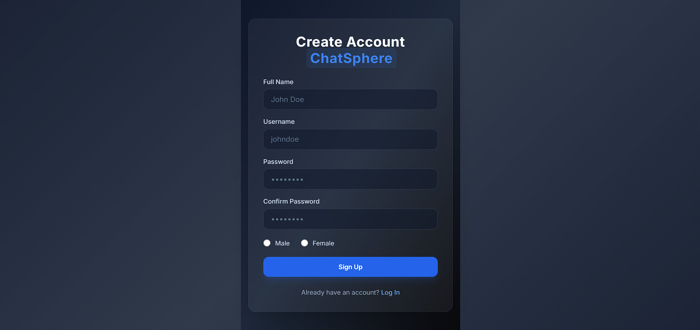
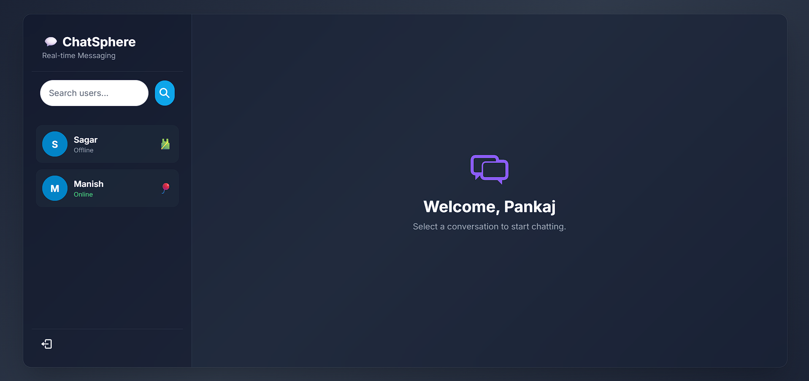

# 💬 ChatSphere — Real-Time MERN Chat Application

ChatSphere is a full-stack, real-time messaging web application engineered with the MERN stack. It enables fluid, immediate communication across clients using active web sockets, wrapped in a responsive interface.


---

## 📸 Application Previews

<p align="center">
  
  
</p>

---

## ✨ Features

* **Instant Messaging Engine:** Built on bidirectional `Socket.io` pipes for sub-millisecond message delivery and typing states.
* **Secure User Authentication:** End-to-end registration/login cycles using JSON Web Tokens (JWT) issued safely via `httpOnly` secure cookies.
* **Presence Tracking:** Live online/offline visibility monitors that broadcast user statuses instantly across the ecosystem.
* **Premium Dynamic Avatars:** High-fidelity profile image generation utilizing the `DiceBear API` tied directly to unique username seeds.
* **Robust Backend Security:** Comprehensive input trimming, data validation layers, and password hashing powered by `bcryptjs`.
* **State Management Architecture:** Clean, accessible frontend global state dispatching handled seamlessly via `Zustand`.

---

## 🛠️ Tech Stack

### Frontend
* React.js
* Tailwind CSS
* Zustand (Global State)
* React Hot Toast

### Backend & Database
* Node.js & Express.js
* Socket.io (WebSockets)
* MongoDB & Mongoose ODM
* Cookie-Parser & JSONWebToken

---

## 🚀 Installation & System Setup

### 1. Environment Variable Configuration
Before executing the development runtimes, create a `.env` file inside your `/backend` directory folder and input the following configuration properties:

```env
PORT=5000
MONGO_DB_URI=your_mongodb_connection
JWT_SECRET=your_custom_jwt_secret_phrase
NODE_ENV=development
